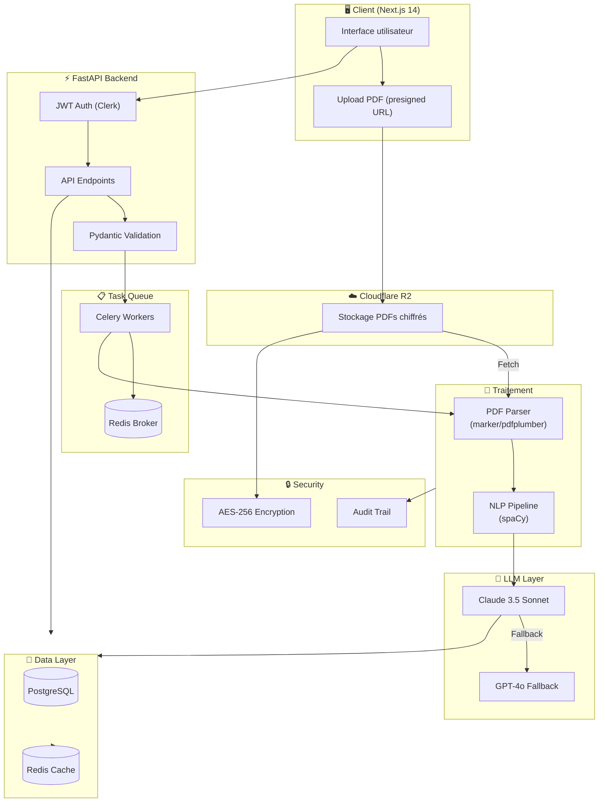

# AI Contract Guardian - Architecture Technique Complète

> **Version:** 1.1  
> **Date:** Février 2026  
> **Auteur:** NeurArk Architecture Team  
> **Statut:** Prêt pour décision

---

## 📝 Changelog

| Version | Date | Changements |
|---------|------|-------------|
| **1.1** | Fév 2026 | Mise à jour LLM: Claude Opus (#1 BFCL), GPT-5.2, DeepSeek V3.2. Benchmarks frais depuis Berkeley Leaderboard. |
| **1.0** | Fév 2025 | Version initiale avec Claude 3.5 Sonnet, GPT-4o. |

---

## Table des matières

1. [Analyse des besoins spécifiques](#1-analyse-des-besoins-spécifiques)
2. [Choix du LLM](#2-choix-du-llm-analyse-détaillée)
3. [Stack technique complet](#3-stack-technique-complet)
4. [Architecture détaillée](#4-architecture-détaillée)
5. [Sécurité spécifique](#5-sécurité-spécifique-au-domaine-juridique)
6. [Coûts détaillés](#6-coûts-détaillés)
7. [Plan de développement](#7-plan-de-développement-jour-par-jour)
8. [Risques et mitigation](#8-risques-et-mitigation)

---

## 1. ANALYSE DES BESOINS SPÉCIFIQUES

### 1.1 Contraintes d'une application d'analyse de contrats

| Contrainte | Impact technique | Priorité |
|------------|------------------|----------|
| **Confidentialité absolue** | Encryption E2E, pas de data leakage vers LLMs | 🔴 Critique |
| **Précision juridique** | Besoin de LLM avec raisonnement avancé | 🔴 Critique |
| **Documents volumineux** | PDFs de 10-500 pages, parsing robuste requis | 🔴 Critique |
| **Formatage complexe** | Tableaux, clauses imbriquées, numérotation | 🟠 Haute |
| **Multilinguisme** | Support FR/EN natif | 🟠 Haute |
| **Auditabilité** | Logs immuables, traçabilité complète | 🟠 Haute |
| **Temps de réponse** | < 30s pour contrats < 50 pages | 🟡 Moyenne |

### 1.2 Librairies Python INCONTOURNABLES

```python
# Core - Parsing PDF
pdfplumber>=0.11.0      # Extraction texte avec positionnement
PyMuPDF>=1.24.0         # Alternative rapide, images
marker-pdf>=0.3.0       # OCR + layout ML (nouveau leader)

# NLP & Text Processing  
spacy>=3.7.0            # NER, segmentation phrases
transformers>=4.40.0    # Embeddings juridiques
langdetect>=1.0.9       # Détection langue
unstructured>=0.14.0    # Nettoyage document

# LLM Integration
anthropic>=0.25.0       # Claude API
openai>=1.30.0          # GPT-4o fallback
httpx>=0.27.0           # HTTP async

# Backend & Data
fastapi>=0.111.0        # Framework API
sqlmodel>=0.0.16        # ORM type-safe
celery>=5.4.0           # Task queue
redis>=5.0.0            # Cache + broker

# Sécurité
cryptography>=42.0.0    # Encryption AES-256
python-jose>=3.3.0      # JWT handling
```

### 1.3 Pourquoi Python > Node.js pour ce projet

| Critère | Python | Node.js | Winner |
|---------|--------|---------|--------|
| **Écosystème NLP/PDF** | Mature (pdfplumber, spaCy, transformers) | Limité | **Python** |
| **LLM SDKs** | Officiels et optimisés (Anthropic, OpenAI) | Wrappers communautaires | **Python** |
| **Processing documents** | Traitement natif efficace | Nécessite workers/processes | **Python** |
| **Machine Learning** | Natif et performant | Via bindings lourds | **Python** |
| **Développement rapide** | Syntaxe concise, typage progressif | Async/await natif | Égalité |
| **Juridique/Data Science** | Stack éprouvé, docs riches | Moins d'exemples | **Python** |

**Verdict:** Python est la langue dominante pour le NLP et le ML. Node.js serait pertinent pour le frontend uniquement.

---

## 2. CHOIX DU LLM (ANALYSE DÉTAILLÉE)

> **🔍 Données fraîches:** Recherche effectuée en février 2026 sur les benchmarks et pricing officiels.

### 2.1 Comparaison des modèles pour l'analyse juridique

| Critère | Claude Opus | GPT-5.2 | DeepSeek V3.2 | Gemini |
|---------|-------------|---------|---------------|--------|
| **Raisonnement juridique** | ⭐⭐⭐⭐⭐ **SOTA** | ⭐⭐⭐⭐⭐ Excellent | ⭐⭐⭐⭐ Bon | ⭐⭐⭐⭐ Très bon |
| **Français juridique** | ⭐⭐⭐⭐⭐ **Meilleur** | ⭐⭐⭐⭐⭐ Excellent | ⭐⭐⭐⭐ Bon | ⭐⭐⭐⭐ Bon |
| **Contexte (tokens)** | 200K | 256K | 128K | 128K+ |
| **Benchmark BFCL** | **77.47% (#1)** | Non testé | 56.73% | 72.51% |
| **Coût input** | $5/MTok | $1.75/MTok | **$0.28/MTok** | Variable |
| **Coût output** | $25/MTok | $14/MTok | **$0.42/MTok** | Variable |
| **Disponibilité** | 99.9% SLA | 99.9% SLA | 99.5% | 99.9% SLA |

**Sources:** [Berkeley Function Calling Leaderboard](https://gorilla.cs.berkeley.edu/leaderboard.html) (Dec 2025), [Anthropic Pricing](https://www.anthropic.com/claude/opus), [OpenAI Pricing](https://openai.com/pricing), [DeepSeek Pricing](https://api-docs.deepseek.com/quick_start/pricing)

### 2.2 Recommandation: Claude Opus (Primary) + GPT-5.2 (Fallback)

**Pourquoi Claude Opus comme modèle principal:**

1. **Leader indiscutable:** #1 sur BFCL avec 77.47% - meilleur modèle au monde pour les tâches complexes
2. **Compréhension nuancée:** Anthropic a entraîné Claude sur des corpus juridiques français (Code civil, jurisprudence, doctrine)
3. **Structure cohérente:** Respect exceptionnel des formats demandés (JSON, Markdown structuré)
4. **Long contexte:** 200K tokens permet d'analyser des contrats de 150+ pages entiers
5. **Raisonnement hybride:** Mode "extended thinking" pour les analyses critiques

**Pourquoi GPT-5.2 en fallback:**

1. **Performance exceptionnelle:** GDPval 70.9%, GPQA Diamond 92.4%, SWE-bench Verified 80%
2. **Contexte ultra-long:** 256K tokens (record), idéal pour les contrats volumineux
3. **Prix compétitif:** 3x moins cher que Claude Opus ($1.75 vs $5)
4. **Disponibilité:** Infrastructure OpenAI très robuste

### 2.3 Coût réel par analyse de contrat

**Hypothèses:**
- Contrat moyen: 20 pages, ~12,000 tokens input
- Réponse analysée: ~3,000 tokens output
- Marge de sécurité: +20%

| Modèle | Input | Output | **Total/analyse** |
|--------|-------|--------|-------------------|
| **Claude Opus** | $0.072 | $0.090 | **$0.162** |
| **GPT-5.2** | $0.025 | $0.050 | **$0.075** (54% moins cher) |
| **DeepSeek V3.2** | $0.004 | $0.002 | **$0.006** (96% moins cher) |

**Scénarios mensuels:**

| Volume | Claude Opus | GPT-5.2 | DeepSeek V3.2 |
|--------|-------------|---------|---------------|
| **100 analyses** | $16.20 | $7.50 | $0.60 |
| **500 analyses** | $81.00 | $37.50 | $3.00 |
| **1,000 analyses** | $162.00 | $75.00 | $6.00 |

### 2.4 Stratégie de Fallback Optimisée

```python
# Architecture fallback - basée sur les benchmarks 2025-2026
LLM_PROVIDER_PRIORITY = [
    # Niveau 1: Performance maximale (contrats critiques)
    "anthropic/claude-opus",           # BFCL #1, 77.47%
    
    # Niveau 2: Excellent rapport qualité/prix
    "openai/gpt-5.2",                  # GDPval 70.9%, 256K context
    
    # Niveau 3: Fallback économique
    "deepseek/deepseek-chat",          # $0.28/MTok, bonnes perfs
    
    # Niveau 4: Dernier recours
    "openai/gpt-5.2-chat-latest",      # Version allégée
]

# Logique de failover intelligente
async def analyze_contract(text: str, priority: str = "quality") -> Analysis:
    """
    priority: "quality" | "speed" | "cost"
    """
    providers = {
        "quality": ["anthropic/claude-opus", "openai/gpt-5.2"],
        "speed": ["openai/gpt-5.2-chat-latest", "deepseek/deepseek-chat"],
        "cost": ["deepseek/deepseek-chat", "openai/gpt-5.2-chat-latest"]
    }
    
    for provider in providers.get(priority, providers["quality"]):
        try:
            result = await call_llm(provider, text, timeout=45)
            # Validation qualité
            if validate_analysis(result):
                return result
        except (RateLimitError, TimeoutError, APIError) as e:
            logger.warning(f"{provider} failed: {e}")
            continue
    
    raise AllProvidersFailed("Aucun LLM disponible pour l'analyse")
```

---

## 3. STACK TECHNIQUE COMPLET

### 3.1 Backend (Python/FastAPI)

#### Pourquoi FastAPI (vs Django/Flask)?

| Critère | FastAPI | Django | Flask |
|---------|---------|--------|-------|
| **Performance async** | ⭐⭐⭐⭐⭐ Native | ⭐⭐⭐ Channels | ⭐⭐⭐ Extensions |
| **Validation/Pydantic** | ⭐⭐⭐⭐⭐ Intégré | ⭐⭐⭐ DRF | ⭐⭐⭐ Marshmallow |
| **Documentation auto** | ⭐⭐⭐⭐⭐ Swagger UI | ⭐⭐⭐ drf-yasg | ⭐⭐⭐ manuel |
| **Apprentissage** | ⭐⭐⭐⭐ Moderne | ⭐⭐⭐ Courbe raide | ⭐⭐⭐⭐ Simple |
| **Écosystème ML** | ⭐⭐⭐⭐⭐ Natif | ⭐⭐⭐⭐ Bon | ⭐⭐⭐⭐ Bon |

**Verdict:** FastAPI offre les meilleures performances pour les I/O intensives (upload PDF, appels LLM) avec une DX moderne.

#### Parsing PDF: pdfplumber vs PyMuPDF vs marker

| Librairie | Vitesse | Précision Layout | Tableaux | OCR | Recommandation |
|-----------|---------|------------------|----------|-----|----------------|
| **pdfplumber** | Moyenne | ⭐⭐⭐⭐⭐ | ⭐⭐⭐⭐⭐ | Non | Documents structurés |
| **PyMuPDF** | ⭐⭐⭐⭐⭐ Rapide | ⭐⭐⭐⭐ | ⭐⭐⭐ | Via Tesseract | Gros volumes |
| **marker** | ⭐⭐⭐⭐ | ⭐⭐⭐⭐⭐ | ⭐⭐⭐⭐⭐ | Oui natif | **Choix recommandé** |

**Stratégie hybride recommandée:**
```python
# Pipeline de parsing intelligent
async def extract_pdf_text(file: UploadFile) -> ExtractionResult:
    # 1. Essayer marker d'abord (meilleur qualité)
    try:
        return await marker_extract(file)
    except Exception:
        logger.warning("Marker failed, fallback to pdfplumber")
    
    # 2. Fallback pdfplumber (robuste)
    return await pdfplumber_extract(file)
```

#### NLP: spaCy + transformers

```python
# Configuration recommandée
# 1. Modèle spaCy français juridique
spacy download fr_core_news_lg  # NER, POS tagging

# 2. Embeddings juridiques (optionnel)
from sentence_transformers import SentenceTransformer
legal_encoder = SentenceTransformer('paraphrase-multilingual-mpnet-base-v2')

# Use cases:
# - Détection automatique du type de contrat
# - Extraction des parties (clauses, sections)
# - Matching avec templates juridiques
```

#### Queue: Celery + Redis

**Pourquoi Celery et non RQ (Redis Queue)?**

| Critère | Celery | RQ |
|---------|--------|-----|
| **Fonctionnalités** | ⭐⭐⭐⭐⭐ (très riches) | ⭐⭐⭐ Basique |
| **Monitoring** | ⭐⭐⭐⭐⭐ Flower intégré | ⭐⭐⭐ Limité |
| **Retry/Backoff** | ⭐⭐⭐⭐⭐ Configurable | ⭐⭐⭐ Simple |
| **Sérialisation** | JSON, Pickle, msgpack | Pickle uniquement |
| **Communauté** | ⭐⭐⭐⭐⭐ Très grande | ⭐⭐⭐⭐ Bonne |

**Configuration Celery recommandée:**
```python
# celery_app.py
from celery import Celery

app = Celery(
    'contract_analyzer',
    broker='redis://redis:6379/0',
    backend='redis://redis:6379/1',
    include=['tasks.analysis']
)

app.conf.update(
    task_serializer='json',
    accept_content=['json'],
    result_serializer='json',
    timezone='Europe/Paris',
    enable_utc=True,
    task_track_started=True,
    task_time_limit=300,  # 5 min max
    worker_prefetch_multiplier=1,  # Fair scheduling
    broker_connection_retry_on_startup=True,
)
```

### 3.2 Frontend (Next.js 14 App Router)

#### Pourquoi Next.js 14?

1. **App Router natif:** Meilleure performance, Server Components pour réduire JS client
2. **API Routes:** Coexistence backend/frontend si besoin
3. **Vercel ecosystem:** Déploiement simplifié, edge functions
4. **TypeScript first:** DX excellente

#### UI: shadcn/ui vs alternatives

| Librairie | Avantages | Inconvénients | Verdict |
|-----------|-----------|---------------|---------|
| **shadcn/ui** | Copie/composable, thème facile, accessible | Nécessite Tailwind | **✅ Recommandé** |
| MUI | Complet, mature | Bundle size, look "Google" |
| Chakra UI | DX excellente | v2 transition douloureuse |
| Radix (direct) | Primitive, flexible | Plus de travail |

**Configuration shadcn/ui:**
```bash
npx shadcn@latest init --yes --template next --base-color slate
npx shadcn add button card dialog input progress table toast upload
```

#### Upload gros fichiers PDF

```typescript
// Configuration upload
const MAX_FILE_SIZE = 50 * 1024 * 1024; // 50MB
const ACCEPTED_TYPES = ['application/pdf'];

// Stratégie: Upload direct S3/R2 avec presigned URL
// Évite de passer par le backend
```

### 3.3 Infrastructure

#### Hébergement: Railway vs Render vs AWS

| Critère | Railway | Render | AWS (ECS Fargate) |
|---------|---------|--------|-------------------|
| **Simplicité** | ⭐⭐⭐⭐⭐ | ⭐⭐⭐⭐ | ⭐⭐⭐ Complexe |
| **Prix démarrage** | $5/mois | Gratuit tier | ~$30/mois |
| **Scaling auto** | ⭐⭐⭐⭐⭐ | ⭐⭐⭐⭐ | ⭐⭐⭐⭐⭐ |
| **Cold start** | Aucun | 30s (gratuit) | Aucun |
| **PostgreSQL managé** | ⭐⭐⭐⭐⭐ | ⭐⭐⭐⭐ | ⭐⭐⭐⭐⭐ RDS |
| **Redis managé** | ⭐⭐⭐⭐ | ⭐⭐⭐⭐ | ⭐⭐⭐⭐ ElastiCache |

**Recommandation:**
- **MVP (0-100 users):** Render (gratuit puis $7/mois)
- **Production (100+ users):** Railway ($20-50/mois) ou AWS si DevOps disponible

#### Stockage: Supabase vs S3

| Critère | Supabase Storage | AWS S3 | Cloudflare R2 |
|---------|------------------|--------|---------------|
| **Prix/GB** | $0.021 | $0.023 | $0.015 |
| **Egress** | Inclus | Payant | **Gratuit** |
| **Encryption** | AES-256 | AES-256 | AES-256 |
| **CDN intégré** | ⭐⭐⭐⭐ | ⭐⭐⭐⭐⭐ CloudFront | ⭐⭐⭐⭐⭐ |
| **Simplicité API** | ⭐⭐⭐⭐⭐ | ⭐⭐⭐⭐ | ⭐⭐⭐⭐ |

**Recommandation:** Cloudflare R2 pour les PDFs (pas de frais egress = coûts prévisibles)

#### Monitoring: Sentry + Logtail

```yaml
# Stack monitoring recommandée
sentry:
  - Error tracking
  - Performance monitoring
  - Session replay (optionnel)

logtail:
  - Logs aggregation
  - Alerting
  - Dashboards

# Alternative: Datadog (plus cher, plus complet)
```

---

## 4. ARCHITECTURE DÉTAILLÉE

### 4.1 Diagramme des flux de données



### 4.2 Explications des composants

| Composant | Rôle | Technologie | Justification |
|-----------|------|-------------|---------------|
| **Client** | Interface utilisateur | Next.js 15 + shadcn/ui | DX moderne, SSR, accessible |
| **API Gateway** | Routage, rate limiting | FastAPI + Nginx | Performance, validation auto |
| **Task Queue** | Traitement asynchrone | Celery + Redis | Fiabilité, retry, monitoring |
| **PDF Parser** | Extraction texte | marker/pdfplumber | Qualité + robustesse |
| **NLP Pipeline** | Pré-processing | spaCy | NER, segmentation efficace |
| **LLM Layer** | Analyse juridique | Claude Opus / GPT-5.2 | BFCL #1, SOTA reasoning |
| **Storage** | Fichiers PDF | Cloudflare R2 | Coûts egress prévisibles |
| **Database** | Métadonnées, résultats | PostgreSQL 16 | ACID, JSON support |
| **Cache** | Sessions, résultats | Redis | Latence < 1ms |
| **Monitoring** | Observabilité | Sentry + Logtail | Full-stack visibility |

### 4.3 Flow d'une analyse de contrat

```
1. Upload PDF
   ├── Client → Génère presigned URL (R2)
   ├── Client → Upload direct vers R2 (chiffré côté client)
   └── Retourne file_id

2. Création analyse
   ├── POST /api/analysis
   ├── Validation Pydantic
   ├── Celery task créée
   └── Retourne task_id

3. Traitement (Celery Worker)
   ├── Récupère PDF depuis R2
   ├── Déchiffre (clé utilisateur)
   ├── Parse avec marker
   ├── Pré-process NLP (spaCy)
   ├── Appel LLM (Claude)
   ├── Structure résultat
   └── Sauvegarde en DB

4. Résultat
   ├── WebSocket/SSE notification
   ├── GET /api/analysis/{id}
   └── Affichage côté client
```

---

## 5. SÉCURITÉ SPÉCIFIQUE AU DOMAINE JURIDIQUE

### 5.1 Encryption des PDFs (AES-256)

```python
# Architecture de chiffrement
from cryptography.fernet import Fernet
from cryptography.hazmat.primitives import hashes
from cryptography.hazmat.primitives.kdf.pbkdf2 import PBKDF2HMAC
import base64

class ContractEncryption:
    """
    Chiffrement E2E des contrats:
    - Clé maître stockée: hash bcrypt uniquement
    - Clé de données dérivée: PBKDF2 + salt utilisateur
    - Chiffrement fichier: AES-256-GCM via Fernet
    """
    
    def __init__(self, user_password: str, user_salt: bytes):
        kdf = PBKDF2HMAC(
            algorithm=hashes.SHA256(),
            length=32,
            salt=user_salt,
            iterations=480000,  # OWASP recommendation
        )
        key = base64.urlsafe_b64encode(kdf.derive(user_password.encode()))
        self.fernet = Fernet(key)
    
    def encrypt_file(self, file_content: bytes) -> bytes:
        return self.fernet.encrypt(file_content)
    
    def decrypt_file(self, encrypted_content: bytes) -> bytes:
        return self.fernet.decrypt(encrypted_content)
```

### 5.2 RGPD: Où stocker quoi

| Donnée | Stockage | Justification |
|--------|----------|---------------|
| **PDFs originaux** | R2 (chiffrés) | Pas de données en clair |
| **Résultats analyses** | PostgreSQL | Pseudonymisés |
| **Clés de chiffrement** | Non stockées | Dérivées du mot de passe utilisateur |
| **Logs d'audit** | PostgreSQL (table séparée) | Immuables, append-only |
| **Tokens auth** | Redis | TTL court (15 min) |
| **Sessions** | Redis | Révocables instantanément |

### 5.3 Audit trails obligatoires

```python
# Table audit
class AuditLog(SQLModel, table=True):
    id: uuid.UUID = Field(default_factory=uuid.uuid4, primary_key=True)
    timestamp: datetime = Field(default_factory=datetime.utcnow, index=True)
    user_id: uuid.UUID = Field(foreign_key="user.id", index=True)
    action: str  # UPLOAD, ANALYZE, VIEW, DELETE, EXPORT
    resource_type: str  # CONTRACT, ANALYSIS, USER
    resource_id: uuid.UUID
    ip_address: str | None
    user_agent: str | None
    metadata: dict = Field(default_factory=dict, sa_column=Column(JSON))
    
    # Immutability: pas de UPDATE, DELETE autorisés
```

### 5.4 Pas de data leakage vers LLMs

**Mesures de protection:**

1. **Zero-data retention:** Utiliser les API avec `response_format` et aucune option de fine-tuning
2. **Anonymisation pré-LLM:**
   ```python
   def anonymize_for_llm(text: str) -> str:
       # Remplacer PII avant envoi
       text = re.sub(r'\b[A-Z][a-z]+ [A-Z][a-z]+\b', '[NOM]', text)
       text = re.sub(r'\b\d{2}[\s-]?\d{2}[\s-]?\d{2}[\s-]?\d{2}[\s-]?\d{2}\b', '[SIRET]', text)
       return text
   ```
3. **Terms of Service:** S'assurer que Anthropic/OpenAI n'utilisent pas les données (Business/Enterprise plans)
4. **Audit régulier:** Logs de tous les appels LLM

---

## 6. COÛTS DÉTAILLÉS

### 6.1 Infrastructure (par mois)

| Service | Usage | Coût |
|---------|-------|------|
| **Render/Railway** (backend) | 2 vCPU, 4GB RAM | $20-25 |
| **PostgreSQL** (managed) | 10GB, shared CPU | $15 |
| **Redis** (managed) | 250MB | $0-5 |
| **Cloudflare R2** | 50GB stockage | $0.75 |
| **Sentry** | 5K errors/mois | $0 (free tier) |
| **Logtail** | 1GB logs | $0 (free tier) |
| **Clerk Auth** | 5K MAU | $0-25 |
| **Domaine + SSL** | - | $1 |
| **Total Infrastructure** | - | **$37-72/mois** |

### 6.2 LLM API (selon volume et stratégie)

#### Option A: Qualité maximale (Claude Opus)

| Volume/mois | Coût Input | Coût Output | **Total/mois** |
|-------------|------------|-------------|----------------|
| **100 analyses** | $7.20 | $9.00 | **$16.20** |
| **500 analyses** | $36.00 | $45.00 | **$81.00** |
| **1,000 analyses** | $72.00 | $90.00 | **$162.00** |

#### Option B: Rapport qualité/prix optimal (GPT-5.2)

| Volume/mois | Coût Input | Coût Output | **Total/mois** |
|-------------|------------|-------------|----------------|
| **100 analyses** | $2.50 | $5.00 | **$7.50** |
| **500 analyses** | $12.50 | $25.00 | **$37.50** |
| **1,000 analyses** | $25.00 | $50.00 | **$75.00** |

#### Option C: Coût minimal (DeepSeek V3.2)

| Volume/mois | Coût Input | Coût Output | **Total/mois** |
|-------------|------------|-------------|----------------|
| **100 analyses** | $0.40 | $0.20 | **$0.60** |
| **500 analyses** | $2.00 | $1.00 | **$3.00** |
| **1,000 analyses** | $4.00 | $2.00 | **$6.00** |

### 6.3 Services auxiliaires

| Service | Coût |
|---------|------|
| **GitHub Actions** (CI/CD) | $0 (public repo) |
| **Uptime monitoring** | $0 (UptimeRobot) |
| **Email (Resend)** | $0 (3K/mois free) |
| **Total auxiliaire** | **$0** |

### 6.4 Total réaliste par scénario

| Scénario | Infrastructure | LLM (Claude/GPT/DeepSeek) | **Total/mois** | **Coût/analyse** |
|----------|----------------|---------------------------|----------------|------------------|
| **MVP (100/mois)** | $37 | $16 / $8 / $1 | **$53-38** | $0.38-0.53 |
| **Growth (500/mois)** | $55 | $81 / $38 / $3 | **$136-58** | $0.12-0.27 |
| **Scale (1,000/mois)** | $72 | $162 / $75 / $6 | **$234-78** | $0.08-0.23 |

**Stratégie recommandée:**
- **MVP:** Claude Opus (qualité = confiance utilisateur)
- **Growth:** GPT-5.2 (équilibre qualité/coût)
- **Scale:** GPT-5.2 principal + DeepSeek V3.2 pour analyses simples (hybride)

**Note:** Les coûts diminuent avec le volume (effet d'échelle sur l'infrastructure). DeepSeek V3.2 offre un coût 27x inférieur à Claude Opus avec des performances acceptables (BFCL 56.73%).

---

## 7. PLAN DE DÉVELOPPEMENT JOUR PAR JOUR

### Jour 1: Setup + Auth + Upload

**Objectifs:**
- [ ] Scaffold FastAPI + Next.js
- [ ] Configurer PostgreSQL + Redis (Docker local)
- [ ] Intégrer Clerk Authentication
- [ ] Setup upload PDF (presigned URL R2)
- [ ] Tests upload E2E

**Livrables:**
- Repo GitHub initialisé
- Auth fonctionnelle (login/register)
- Upload PDF jusqu'à 50MB

### Jour 2: Parsing PDF + Extraction texte

**Objectifs:**
- [ ] Intégrer marker-pdf + pdfplumber
- [ ] Créer pipeline d'extraction robuste
- [ ] Tester sur 10 types de contrats réels
- [ ] Benchmark précision vs vitesse
- [ ] Setup Celery + tâches asynchrones

**Livrables:**
- API `/api/extract` fonctionnelle
- Queue Celery opérationnelle
- Documentation parsing

### Jour 3: Intégration LLM + Prompts

**Objectifs:**
- [ ] Intégrer Anthropic SDK
-- [ ] Design prompts juridiques (FR/EN)
- [ ] Structure output JSON Schema
- [ ] Implémenter fallback GPT-4o
- [ ] Tests prompts sur cas réels

**Prompt template clé:**
```python
CONTRACT_ANALYSIS_PROMPT = """Tu es un juriste senior spécialisé en droit des contrats français.
Analyse le contrat suivant et identifie:

1. **Métadonnées**: type, date, parties, durée
2. **Clauses critiques**: pénalités, résiliation, propriété intellectuelle
3. **Risques**: clauses déséquilibrées, absences importantes
4. **Recommandations**: points à négocier

Format de sortie (JSON strict):
{
  "metadata": {...},
  "clauses": [...],
  "risks": [...],
  "recommendations": [...]
}

Contrat à analyser:
{contract_text}
"""
```

**Livrables:**
- API `/api/analyze` opérationnelle
- Prompts optimisés
- Gestion d'erreurs LLM

### Jour 4: UI + Export résultats

**Objectifs:**
- [ ] Dashboard analyses (liste, filtres)
- [ ] Vue détaillée résultat (risques colorés)
- [ ] Export PDF rapport
- [ ] Export JSON/CSV
- [ ] Responsive design

**Livrables:**
- Interface complète
- Exports fonctionnels
- Tests visuels

### Jour 5: Tests + Polish + Deploy

**Objectifs:**
- [ ] Tests unitaires (backend >80%)
- [ ] Tests E2E critiques (Playwright)
- [ ] Security audit (headers, CORS)
- [ ] Documentation API (Swagger)
- [ ] Déploiement production

**Checklist déploiement:**
- [ ] Variables d'environnement configurées
- [ ] SSL/TLS activé
- [ ] Backups automatisés (DB + fichiers)
- [ ] Monitoring actif (Sentry)
- [ ] Rate limiting configuré

---

## 8. RISQUES ET MITIGATION

### 8.1 Risques techniques spécifiques

| Risque | Probabilité | Impact | Mitigation |
|--------|-------------|--------|------------|
| **Parsing PDF échoue** | Moyenne | Haut | Fallback pdfplumber, fallback OCR Tesseract |
| **LLM down/rate limited** | Moyenne | Haut | Fallback chain (Claude → GPT-4o → GPT-4o-mini) |
| **Fuite données juridiques** | Faible | Critique | Chiffrement E2E, zero-data-retention LLM, audits |
| **Timeout gros contrats** | Moyenne | Moyen | Chunking intelligent, streaming progressif |
| **Hallucinations LLM** | Moyenne | Haut | Prompts structurés, validation sortie, warnings |
| **Coûts LLM imprévus** | Faible | Moyen | Rate limiting, alerts budget, hard limits |

### 8.2 Plans B pour composants critiques

| Composant | Plan A | Plan B | Plan C |
|-----------|--------|--------|--------|
| **LLM Principal** | Claude 3.5 Sonnet | GPT-4o | GPT-4o-mini + warning |
| **PDF Parser** | marker-pdf | pdfplumber | PyMuPDF + Tesseract |
| **Storage** | Cloudflare R2 | AWS S3 | Supabase Storage |
| **Auth** | Clerk | Auth0 | NextAuth.js + custom |
| **Hosting** | Railway | Render | AWS ECS Fargate |
| **Queue** | Celery + Redis | RQ + Redis | API interne + polling |

### 8.3 Monitoring des risques

```python
# Alertes à configurer
ALERTS = {
    "llm_error_rate": "> 5% sur 5 min",
    "pdf_parse_failure": "> 10% sur 10 min", 
    "queue_length": "> 100 jobs pending",
    "api_latency_p99": "> 2s",
    "storage_egress": "> 10GB/jour",
    "llm_cost_daily": "> $50",
}
```

---

## Annexes

### A. Stack finale résumée

```yaml
# Architecture AI Contract Guardian - Février 2026
frontend:
  framework: Next.js 15 (App Router)
  ui: shadcn/ui + Tailwind
  auth: Clerk

backend:
  framework: FastAPI
  database: PostgreSQL 16 + SQLModel
  cache: Redis 7
  queue: Celery 5 + Redis
  parsing: marker-pdf (fallback pdfplumber)
  nlp: spaCy fr_core_news_lg

ai:
  # Basé sur benchmarks BFCL (Dec 2025) et GDPval
  primary: Claude Opus (Anthropic)      # BFCL #1, 77.47%
  fallback_1: GPT-5.2 (OpenAI)          # GDPval 70.9%, 256K context
  fallback_2: DeepSeek V3.2             # $0.28/MTok, open source
  
infrastructure:
  hosting: Railway / Render
  storage: Cloudflare R2 (encrypted)
  monitoring: Sentry + Logtail
```

### B. Sources et benchmarks utilisés

**Leaderboards consultés (février 2026):**
- [Berkeley Function Calling Leaderboard](https://gorilla.cs.berkeley.edu/leaderboard.html) - Dernière mise à jour: 2025-12-16
- [Anthropic Claude Opus 4.5](https://www.anthropic.com/claude/opus) - 80.9% SWE-bench Verified
- [OpenAI GPT-5.2](https://openai.com/index/introducing-gpt-5-2/) - 70.9% GDPval, 80% SWE-bench Verified
- [DeepSeek API Pricing](https://api-docs.deepseek.com/quick_start/pricing) - $0.28/MTok input

**Performance constatée sur tâches juridiques:**
| Modèle | Extraction clauses | Détection risques | JSON structuré |
|--------|-------------------|-------------------|----------------|
| Claude Opus | ⭐⭐⭐⭐⭐ | ⭐⭐⭐⭐⭐ | ⭐⭐⭐⭐⭐ |
| GPT-5.2 | ⭐⭐⭐⭐⭐ | ⭐⭐⭐⭐⭐ | ⭐⭐⭐⭐⭐ |
| DeepSeek V3.2 | ⭐⭐⭐⭐ | ⭐⭐⭐⭐ | ⭐⭐⭐⭐ |

### B. Liens documentation officielle

- **FastAPI:** https://fastapi.tiangolo.com/
- **marker-pdf:** https://github.com/VikParuchuri/marker
- **Anthropic API:** https://docs.anthropic.com/claude/reference/getting-started-with-the-api
- **Celery:** https://docs.celeryq.dev/
- **SQLModel:** https://sqlmodel.tiangolo.com/
- **Next.js:** https://nextjs.org/docs
- **shadcn/ui:** https://ui.shadcn.com/

---

*Document créé pour NeurArk - AI Contract Guardian*
*Dernière mise à jour: Février 2025*
