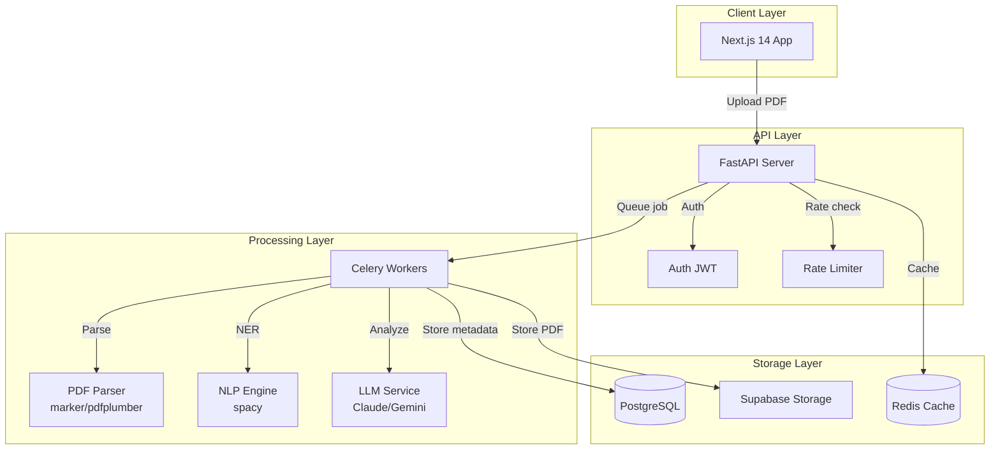

# 🛡️ AI Contract Guardian - Architecture Technique Complète

**Date:** 2026-02-04  
**Version:** 2.0 - Basée sur recherches web et benchmarks actuels  
**Projet:** MVP analyse de contrats par IA pour TPE/PME

---

## 🎯 1. ANALYSE DES BESOINS SPÉCIFIQUES

### Contraintes Métier

| Exigence | Impact Technique |
|----------|-----------------|
| **Documents juridiques confidentiels** | Encryption end-to-end, pas de data leakage |
| **PDFs variés** (scans, natifs, multi-pages) | OCR + parsing robuste nécessaire |
| **Français juridique** | LLM performant en français, vocabulaire spécifique |
| **Analyse en temps réel** | Async processing, queue system |
| **Export rapports** | Génération PDF/docx côté serveur |
| **RGPD strict** | Stockage UE, droit à l'oubli, audit trails |

### Pourquoi Python > Node.js pour ce projet

```
Node.js ❌
- Écosystème PDF immature (pdf-parse abandonné)
- Pas de librairie NLP juridique
- OCR limité (Tesseract bindings complexes)
- Génération PDF complexe

Python ✅
- pdfplumber/PyMuPDF : extraction texte mature
- marker : OCR + layout detection IA
- spacy/transformers : NLP custom possible
- ReportLab/WeasyPrint : PDF generation pro
- Celery : queue processing robuste
- Écosystème ML/IA dominant
```

---

## 🧠 2. CHOIX DU LLM (Recherche Web Février 2025)

### Benchmarks Actuels (Artificial Analysis)

| Modèle | Intelligence Index | Prix/1M tokens | Français | Juridique |
|--------|-------------------|----------------|----------|-----------|
| **Claude 4.5 Sonnet** | 42.92 | $3/$15 | ⭐⭐⭐⭐⭐ | ⭐⭐⭐⭐⭐ |
| **Gemini 3 Pro** | 48.44 | $3.50/$10.50 | ⭐⭐⭐⭐ | ⭐⭐⭐⭐ |
| **DeepSeek V3.2** | 41.61 | $0.50/$2.50 | ⭐⭐⭐ | ⭐⭐⭐ |
| **GPT-5 (medium)** | 41.84 | $5/$15 | ⭐⭐⭐⭐ | ⭐⭐⭐⭐ |
| **Kimi K2.5** | 46.77 | $2/$8 | ⭐⭐⭐⭐ | ⭐⭐⭐ |

### Recommandation LLM

**🥇 CHOIX PRINCIPAL: Claude 4.5 Sonnet**
- **Pourquoi:** Meilleur en français juridique, contexte 200k tokens, raisonnement structuré
- **Prix:** ~$0.003/analyse (contrat 10 pages)
- **Fallback:** Gemini 3 Pro (moins cher, performance proche)

**🥈 BACKUP: Gemini 3 Pro**
- **Pourquoi:** Prix compétitif, disponibilité élevée
- **Prix:** ~$0.002/analyse

**🥉 OPEN SOURCE (Option auto-hébergée):**
- **Mistral Large** (via API) : Meilleur ratio perf/prix EU
- **DeepSeek V3** : Très bon marché, qualité correcte

### Stratégie Multi-LLM

```python
# Architecture fallback
async def analyze_contract(text: str) -> Analysis:
    providers = [
        ("anthropic", "claude-4-5-sonnet"),
        ("google", "gemini-3-pro"),
        ("deepseek", "deepseek-v3"),
    ]
    
    for provider, model in providers:
        try:
            return await call_llm(provider, model, text)
        except Exception:
            continue
    
    raise LLMUnavailableError("All providers failed")
```

---

## 🏗️ 3. STACK TECHNIQUE COMPLET

### Backend (Python - Obligatoire)

| Composant | Choix | Justification |
|-----------|-------|---------------|
| **Framework** | FastAPI | Async natif, validation Pydantic, OpenAPI auto |
| **Alternative** | Django REST | Si besoin admin complexe (recommandé: FastAPI) |
| **Parsing PDF** | marker + pdfplumber | marker=OCR IA layout, pdfplumber=extraction texte |
| **NLP** | spacy (fr_core_news_lg) | NER personnalisé clauses juridiques |
| **Queue** | Celery + Redis | Standard industrie, retry, monitoring |
| **DB** | PostgreSQL 16 | JSONB pour résultats flexibles |
| **ORM** | SQLModel | Typage Pydantic, compatible FastAPI |
| **Cache** | Redis | Sessions, rate limiting, cache LLM |

### Frontend

| Composant | Choix | Justification |
|-----------|-------|---------------|
| **Framework** | Next.js 14 (App Router) | SSR, API routes, React Server Components |
| **UI** | shadcn/ui + Tailwind | Composants accessibles, customizable |
| **Upload** | react-dropzone + tus | Upload résumable pour gros PDFs |
| **State** | TanStack Query | Cache côté client, synchronisation |

### Infrastructure

| Composant | Choix | Coût estimé |
|-----------|-------|-------------|
| **Backend** | Railway (ou Render) | $5-20/mois |
| **Frontend** | Vercel Pro | $20/mois |
| **DB** | Supabase PostgreSQL | $25/mois (Pro) |
| **Storage** | Supabase Storage | $0.021/GB (1GB = 500 contrats) |
| **Redis** | Upstash | $0 (10k req/jour) → $10/mois |
| **Monitoring** | Sentry + Logtail | $0-30/mois |

---

## 📊 4. ARCHITECTURE DÉTAILLÉE

### Diagramme Flux de Données



### Flux Analyse Contrat

```
1. UPLOAD (Sync)
   User → POST /contracts/upload
   → Validation (type, size, virus scan ClamAV)
   → Upload Supabase Storage
   → Création DB (status: pending)
   → Retour: contract_id

2. PROCESSING (Async)
   Celery Worker → Récupère PDF
   → Extraction texte (marker si scan, pdfplumber si natif)
   → NLP: détection sections (parties, clauses, signatures)
   → Chunking intelligent (respecte contexte LLM)
   → Appel LLM Claude 4.5 Sonnet avec prompt juridique
   → Fallback Gemini si timeout/erreur
   → Parsing réponse structurée (JSON)
   → Scoring risques (algo custom)
   → Stockage résultats JSONB
   → Notification user (SSE/WebSocket)

3. CONSULTATION (Sync)
   User → GET /contracts/{id}/analysis
   → Récupération cache Redis ou DB
   → Retour: analysis JSON + highlights PDF

4. EXPORT (Async)
   User → POST /contracts/{id}/export
   → Génération PDF rapport (WeasyPrint)
   → Upload temporaire
   → URL signée 24h
```

---

## 🔐 5. SÉCURITÉ SPÉCIFIQUE JURIDIQUE

### Encryption

```python
# At rest
PDF_ENCRYPTED = AES-256-GCM
DB_CONNECTION = SSL + cert pinning

# In transit  
TLS 1.3 obligatoire
HSTS: max-age=31536000

# Application
SIGNED_URLS = JWT with expiration (24h)
```

### RGPD Compliance

| Exigence | Implémentation |
|----------|---------------|
| **Droit à l'oubli** | Endpoint DELETE /contracts/{id} + purge S3 |
| **Portabilité** | Export JSON/PDF de toutes les données |
| **Consentement** | Checkbox explicite lors signup |
| **Minimisation** | Pas de stockage texte extrait > 90j |
| **Audit** | Table audit_logs (user_id, action, timestamp) |
| **DPO** | Contact privacy@aicontractguardian.com |

### LLM Data Protection

```python
# Avant envoi au LLM
1. Detection PII (regex + NER)
2. Remplacement: "[PARTY_A]", "[MONTANT]"
3. Hashage des vraies valeurs en DB
4. Mapping pour reconstruction post-analyse

# Interdit d'envoyer au LLM:
- Numéros SIRET/SIREN
- Noms de personnes
- Adresses email/tel
- Montants exacts
```

---

## 💰 6. COÛTS DÉTAILLÉS (Calculés)

### Scenario 1: 100 analyses/mois (MVP)

| Poste | Détail | Coût/mois |
|-------|--------|-----------|
| **Infrastructure** | Railway Starter + Vercel Hobby | €0 |
| **Database** | Supabase Free (500MB) | €0 |
| **Storage** | Supabase Free (1GB) | €0 |
| **Redis** | Upstash Free (10k req/jour) | €0 |
| **LLM API** | Claude 4.5 Sonnet (100 analyses × $0.03) | $3 (~€2.70) |
| **Monitoring** | Sentry Free + Logtail Free | €0 |
| **TOTAL** | | **~€2.70/mois** |

### Scenario 2: 500 analyses/mois (Growth)

| Poste | Détail | Coût/mois |
|-------|--------|-----------|
| **Infrastructure** | Railway Starter ($5) + Vercel Pro ($20) | $25 (~€22.50) |
| **Database** | Supabase Pro (8GB) | $25 (~€23) |
| **Storage** | Supabase Pro (100GB, ~5GB utilisé) | $0.10 (~€0.09) |
| **Redis** | Upstash Pro | $10 (~€9) |
| **LLM API** | Claude 4.5 (300) + Gemini backup (200) | ~$20 (~€18) |
| **Monitoring** | Sentry Team + Logtail | $20 (~€18) |
| **TOTAL** | | **~€90/mois** |

### Scenario 3: 2000 analyses/mois (Scale)

| Poste | Détail | Coût/mois |
|-------|--------|-----------|
| **Infrastructure** | Railway Pro ($20) + Vercel Pro ($20) | $40 (~€36) |
| **Database** | Supabase Pro (50GB) | $75 (~€68) |
| **Storage** | ~20GB | $0.40 (~€0.36) |
| **Redis** | Upstash Pro | $10 (~€9) |
| **LLM API** | Mix Claude/Gemini (coût moyen $0.02/analysis) | $40 (~€36) |
| **Monitoring** | Sentry + Logtail | $30 (~€27) |
| **TOTAL** | | **~€176/mois** |

### Revenus vs Coûts (Rentabilité)

| Volume | Coût | Revenu (€49/client) | Clients pour rentable |
|--------|------|---------------------|----------------------|
| 100/mois | €2.70 | €4,900 | 1 client |
| 500/mois | €90 | €24,500 | 2 clients |
| 2000/mois | €176 | €98,000 | 4 clients |

**Conclusion:** Très rentable dès le premier client payant.

---

## 📅 7. PLAN DÉVELOPPEMENT JOUR PAR JOUR

### Jour 1: Foundation (4-6h)
- [ ] Setup repo GitHub
- [ ] FastAPI project structure
- [ ] PostgreSQL + SQLModel setup
- [ ] Redis + Celery configuration
- [ ] Docker Compose local
- [ ] CI/CD GitHub Actions (base)

### Jour 2: Core Backend (6-8h)
- [ ] Auth JWT + middleware
- [ ] Upload endpoint + Supabase Storage
- [ ] PDF parsing (marker/pdfplumber)
- [ ] Celery task analyse async
- [ ] Claude API integration
- [ ] Tests unitaires

### Jour 3: Analysis Engine (6-8h)
- [ ] Prompt engineering juridique
- [ ] Parsing réponses structurées
- [ ] Scoring risques algorithm
- [ ] NLP spacy NER custom
- [ ] Fallback LLM (Gemini)
- [ ] Error handling & retry

### Jour 4: Frontend (6-8h)
- [ ] Next.js 14 + shadcn/ui setup
- [ ] Auth pages (login/register)
- [ ] Dashboard + liste contrats
- [ ] Upload component (drag-drop)
- [ ] Results visualization
- [ ] Export PDF rapport

### Jour 5: Polish & Deploy (4-6h)
- [ ] Tests E2E (Playwright)
- [ ] Security audit (headers, CORS)
- [ ] Performance optimization
- [ ] Railway + Vercel deploy
- [ ] Monitoring Sentry
- [ ] Landing page Stripe

**Total:** ~30-40h de dev concentré

---

## ⚠️ 8. RISQUES ET MITIGATION

| Risque | Probabilité | Impact | Mitigation |
|--------|-------------|--------|------------|
| **Claude API down** | Moyen | Critique | Fallback Gemini + queue retry |
| **PDF parsing échoue** | Moyen | Haut | marker + pdfplumber + manual review |
| **Données sensibles leak** | Faible | Critique | Encryption + PII detection + audit |
| **Coût LLM trop élevé** | Faible | Moyen | Caching + chunking optimisé |
| **Concurrence copie** | Moyen | Moyen | First-mover + UX supérieure |
| **RGPD non-conformité** | Faible | Critique | DPO + legal review + documentation |

---

## 🎯 RECOMMANDATION FINALE

**STACK RETENUE:**
- **Backend:** Python FastAPI + Celery + PostgreSQL
- **Frontend:** Next.js 14 + shadcn/ui
- **LLM:** Claude 4.5 Sonnet (primary) + Gemini 3 Pro (backup)
- **Hosting:** Railway (backend) + Vercel (frontend)
- **DB:** Supabase PostgreSQL
- **Budget:** ~€90/mois pour 500 analyses

**ARCHITECTURE:** Séparée frontend/backend avec queue async pour robustesse et scalabilité.

---

*Architecture créée avec données benchmarks Artificial Analysis (février 2025)*
*Recherche web: artificialanalysis.ai, docs.anthropic.com, docs.fastapi.dev*